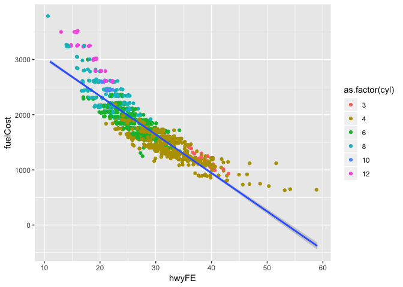

Lab-11 Replication
================
Christopher Prener, Ph.D.
(November 19, 2018)

## Introduction

This notebook replicates Lab-11.

## Dependencies

This notebook requires only a few packages:

``` r
# tidyverse packages
library(ggplot2)      # data plotting

# other packages
library(here)         # file path management
```

    ## here() starts at /Users/chris/GitHub/SOC5050/LectureRepos/lecture-12/assignments/lab-11-replication

``` r
library(testDriveR)   # data
```

## Load Data

This notebook requires the `auto17` data from `testDriveR`:

``` r
autoData <- auto17
```

## Part 1: Regression Model 1

## Question 1

The following code creates a scatter plot comparing fuel cost to
displacement (in liters). The plot uses the `jitter` position to make
points more visible, and colors the points using the variable `gears`
transformed into a factor variable. It also has a linear model overlaid.

``` r
ggplot(data = autoData, mapping = aes(x = displ, y = fuelCost)) +
  geom_point(mapping = aes(color = as.factor(gears)), position = "jitter") +
  geom_smooth(method = "lm")
```

<!-- -->

There is a clear linear relationship between fuel cost and engine size.
The larger the engine, the higher the fuel cost. The relationship with
gears is less clear. There does seem to be a general pattern where
higher geared cars have higher fuel cost, but there are also a high
number of cars with 8 gears that have small engines and relatively low
fuel cost.

``` r
ggsave(filename = here("results", "scatter_displ_fuel.png"), dpi = 300)
```

    ## Saving 7 x 5 in image

## Question 2

The hypotheses we are testing are:

  - H0 - engine size does not have an impact on a car’s annual fuel cost
  - H1 - engine size does have an impact on a car’s annual fuel cost -
    the higher the engine size, the higher the expected fuel costs.

## Question 3

The equation for the regression model in question 4 is:

$ {y}*{fuelCost} = + {}*{1}{x}\_{displ} + $

## Question 4

The following saves the results of the linear model specified in
question 3 into the object `model`, and then reports a summary of the
linear model’s results.

``` r
model <- lm(fuelCost ~ displ, data = autoData)
summary(model)
```

    ## 
    ## Call:
    ## lm(formula = fuelCost ~ displ, data = autoData)
    ## 
    ## Residuals:
    ##     Min      1Q  Median      3Q     Max 
    ## -768.24 -175.18    2.63  157.33 1757.33 
    ## 
    ## Coefficients:
    ##             Estimate Std. Error t value Pr(>|t|)    
    ## (Intercept)  907.346     19.127   47.44   <2e-16 ***
    ## displ        283.831      5.626   50.45   <2e-16 ***
    ## ---
    ## Signif. codes:  0 '***' 0.001 '**' 0.01 '*' 0.05 '.' 0.1 ' ' 1
    ## 
    ## Residual standard error: 267.3 on 1214 degrees of freedom
    ## Multiple R-squared:  0.6771, Adjusted R-squared:  0.6768 
    ## F-statistic:  2545 on 1 and 1214 DF,  p-value: < 2.2e-16

A unit increase in displacement is associated with an increase in fuel
cost. For every liter increase in displacement, the average cost of fuel
per year rises $283.83 (\(p<.001\)). Overall, engine size accounts for
67.71% of the variation in fuel cost.

## Part 2: Regression Model 2

## Question 5

The following code creates a scatter plot comparing fuel cost to highway
fuel efficiency (in miles per gallon). The plot uses the `jitter`
position to make points more visible, and colors the points using the
variable `cyl` transformed into a factor variable. It also has a linear
model overlaid.

``` r
ggplot(data = autoData, mapping = aes(x = hwyFE, y = fuelCost)) +
  geom_point(mapping = aes(color = as.factor(cyl)), position = "jitter") +
  geom_smooth(method = "lm")
```

<!-- -->

Once again, there is a clear relationship between fuel cost and highway
fuel efficiency. The more efficient cars also have lower fuel costs. The
relationship, however, does not be linear. Unlike the previous plot, the
patterning with cylinders is clearer than gears - cars with a larger
number of cylinders have both higher fuel costs and lower highway fuel
efficiency.

``` r
ggsave(filename = here("results", "scatter_hwy_fuel.png"), dpi = 300)
```

    ## Saving 7 x 5 in image

## Question 6

The hypotheses we are testing are:

  - H0 - highway fuel efficiency does not have an impact on a car’s
    annual fuel cost
  - H1 - highway fuel efficiency does have an impact on a car’s annual
    fuel cost - the higher the fuel efficiency, the lower the expected
    fuel costs.

## Question 7

The equation for the regression model in question 8 is:

$ {y}*{fuelCost} = + {}*{1}{x}\_{hwyFE} + $

## Question 8

The following saves the results of the linear model specified in
question 7 into the object `model`, and then reports a summary of the
linear model’s results.

``` r
model <- lm(fuelCost ~ hwyFE, data = autoData)
summary(model)
```

    ## 
    ## Call:
    ## lm(formula = fuelCost ~ hwyFE, data = autoData)
    ## 
    ## Residuals:
    ##     Min      1Q  Median      3Q     Max 
    ## -549.47 -161.90  -19.13  129.14 1029.42 
    ## 
    ## Coefficients:
    ##             Estimate Std. Error t value Pr(>|t|)    
    ## (Intercept) 3730.101     29.149  127.97   <2e-16 ***
    ## hwyFE        -69.653      1.024  -68.04   <2e-16 ***
    ## ---
    ## Signif. codes:  0 '***' 0.001 '**' 0.01 '*' 0.05 '.' 0.1 ' ' 1
    ## 
    ## Residual standard error: 214.4 on 1214 degrees of freedom
    ## Multiple R-squared:  0.7922, Adjusted R-squared:  0.7921 
    ## F-statistic:  4629 on 1 and 1214 DF,  p-value: < 2.2e-16

A unit increase in highway fuel efficiency is associated with an
decrease in fuel cost. For every mile per gallon increase in efficiency,
the average cost of fuel per year decreases $69.65 (\(p<.001\)).
Overall, highway fuel efficiency accounts for 79.22% of the variation in
fuel cost.
